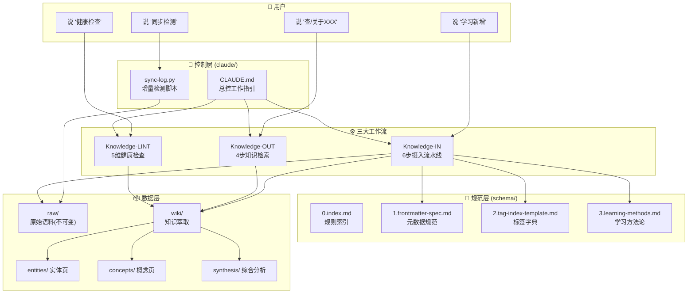

# LLM Wiki Framework

> 一套经过实战验证的 **LLM 驱动知识库管理框架**。用自然语言工作指引替代传统代码逻辑，让 Claude（或其他 LLM）按标准化流程摄入、检索和维护你的 Markdown 知识库。

**适用场景**: 机构知识管理、个人笔记体系化、政策研究、案例库建设。虽然脱胎于高校管理场景，但框架本身与领域无关。

---

## 设计哲学

三条原则贯穿始终：

| 原则 | 含义 |
|------|------|
| **标签是地基** | 所有知识页通过统一的标签体系组织，禁止 LLM 凭空捏造标签，确保检索一致性 |
| **进出有记录** | 每次知识入库必须更新 source 和 last-updated，形成可追溯的知识演化链 |
| **方法标准化** | 不同文件类型对应固定的提取方法论，LLM 只需按路由选择，不自行发挥 |

---

## 系统架构



### 架构分层

| 层 | 目录 | 职责 | 关键文件 |
|---|------|------|---------|
| **控制层** | `claude/` | 定义 LLM 行为的自然语言工作指引 + 工具脚本 | `CLAUDE.md`, `sync-log.py` |
| **规范层** | `schema/` | 规则标准，不包含知识内容 | 4 个 .md 规范文件 |
| **数据层** | `raw/` + `wiki/` | 原始语料（不可变）+ 知识萃取（可写）| 用户按需填充 |

核心思路：**控制层告诉 LLM 做什么，规范层告诉 LLM 怎么做，数据层是 LLM 操作的对象。**

---

## 目录结构

```
your-knowledge-base/
├── .claude/                ← Claude Code 配置（可选，如果你用 Claude Code）
├── claude/                 ← 本框架：工作流配置
│   ├── CLAUDE.md           ← LLM 总控工作指引
│   └── sync-log.py         ← 增量检测 + 空壳扫描
├── schema/                 ← 本框架：规则标准
│   ├── 0.index.md          ← 规则索引
│   ├── 1.frontmatter-spec.md ← Frontmatter 规范
│   ├── 2.tag-index-template.md ← 标签体系模板
│   └── 3.learning-methods.md   ← 结构化学习法
├── templates/              ← 本框架：初始化模板
│   └── wiki-directory-structure.md
├── raw/                    ← 原始语料（只写不入）
│   ├── policy/             ← 政策文件
│   ├── sources/            ← 外部来源
│   ├── practice/           ← 实践材料
│   ├── documents/          ← 内部文档
│   ├── case-studies/       ← 案例
│   ├── research/           ← 研究资料
│   └── interviews/         ← 访谈
└── wiki/                   ← 知识萃取（可写可改）
    ├── index.md            ← 导航中心
    ├── log.md              ← 操作日志
    ├── open-questions.md   ← 待解决问题
    ├── entities/           ← 机构、人物实体页
    ├── concepts/           ← 概念、知识点页
    └── synthesis/          ← 综合分析产出
```

---

## 三大工作流详解

### 1. Knowledge-IN（知识摄入）

**触发词**: "学习"、"提炼"、"入库"

最核心的流程——将原始文件转化为结构化知识并写入 wiki。

```
Step 1: 文件诊断
   ├─ 运行 sync-log.py 发现新文件
   ├─ 判定文件状态：非md/链接壳/图片型/正常md
   └─ 每个文件必须有诊断标签

Step 2: 格式预处理（仅异常状态文件）
   ├─ .docx/.pdf → 转换为 .md
   ├─ 链接壳 → defuddle 提取网页正文
   └─ 图片型 → OCR 提取文字

Step 3: 讨论确认
   └─ AI 列出 3-5 条核心要点，用户确认方向

Step 4: 按类型提取
   ├─ 政策类 → 政策学习法（5步）
   ├─ 案例类 → 案例拆解法（四问+双写）
   └─ 学术类 → 观点萃取法（3步）

Step 5: 存储
   ├─ 外部来源 → wiki/concepts/ 或 wiki/entities/
   └─ 内部文件 → 三层分流（稳定层/年度层/事件层）

Step 6: 更新记录
   └─ frontmatter source置顶 + last-updated更新
```

### 2. Knowledge-OUT（知识调用）

**触发词**: "查"、"调取"、"关于XXX"

```
解析需求 → Grep检索wiki → 输出结果(标来源+置信度) → 有价值则回写synthesis/
```

### 3. Knowledge-LINT（健康检查）

**触发词**: "健康检查"、"查矛盾"、"查遗漏"

```
矛盾检测 → 时效检测(>60天未更新) → 孤立检测(无入链页面) → 缺口检测 → 输出报告
```

---

## 核心设计决策与实战经验

以下是在真实践用约半年后沉淀的关键经验。

### 1. 为什么用 Markdown + Frontmatter 而非数据库

**决策**: 全部知识存储在 Markdown 文件中，用 YAML frontmatter 承载元数据。

**原因**:
- **LLM 原生可读**: LLM 直接读取 .md 文件，无需 SQL 查询或 API 调用
- **版本可控**: Git diff 对纯文本友好，可追踪知识的每次变更
- **互操作性**: Obsidian、VS Code、Notion 等工具都能打开
- **零运维**: 不需要数据库服务，不需要 schema migration

**代价**: 无法做复杂的关系查询。解决方案：用 Grep 全文搜索 + [[wiki链接]] 建立页面间关联。

### 2. 为什么将完成标准内嵌在步骤中

**决策**: 每一步的完成标准写在步骤描述内部（如 `✅ 完成标准：同名 .md 存在且 ≥5 行正文`），不设独立的事后检查环节。

**原因**:
- LLM 倾向于线性执行。如果检查环节独立，LLM 可能在执行完毕后"忘记"回头验证
- 将标准前置让 LLM 在每一步就有明确的"完成"定义
- 减少了需要人工确认的步骤数

**实践中发现的坑**: 最初的设计在 Step 5 之后单独设 Step 6 做"内容核查"，结果 LLM 经常在 Step 5 写入了 source 列表但不写入实际内容。将标准内嵌到 Step 5（`禁止用"更新 source 列表"替代"内容入库"`）后显著改善。

### 3. 标签体系的分层设计与增长机制

**决策**: 三级标签结构（模块→一级→二级），且 LLM 禁止捏造标签。

**原因**:
- **一致性保障**: 如果 LLM 可以自由创建标签，同一个概念会被打上不同标签名（如"产教融合"vs"校企合作"）,检索时必然遗漏
- **增长控制**: 标签可以增长，但必须通过 `open-questions` 提案 → 人工审核 → 写入字典的流程

**关键数字**: 13 个一级标签 + ~90 个二级标签覆盖了高校管理的所有领域。这个规模在"够细"和"不过拟合"之间取得了平衡。对于其他领域，建议 8-15 个一级标签。

### 4. source 列表的置顶规则

**决策**: frontmatter 的 source 列表采用倒序排列——最新来源置顶。

**原因**: 这个看似微小的设计有实际意义。当 LLM 读取一个概念页时，source 列表的第一个就是最近更新的来源，LLM 可以直接判断"这个知识点的最新依据是什么"。如果按自然顺序（旧→新），LLM 需要翻到列表底部才能找到最新来源。

```
正确: source: [最新.md, 次新.md, 最早.md]
错误: source: [最早.md, 次新.md, 最新.md]  # LLM 无法快速定位
```

### 5. 空壳文件检测策略

**决策**: sync-log.py 不仅检测文件存在/缺失，还检测"空壳"——看起来是 .md 但实际无有效内容的文件。

**空壳来源**:
- 微信公众号分享到 Obsidian 时只保存了标题和 URL
- 网页裁剪工具只抓取了模板文字（"微信扫一扫""阅读原文"等）
- PDF 转换失败产生空文件

**检测方法**:
- 阈值法: 文件大小 < 500 bytes 且 ≤5 行正文
- 特征词法: 匹配已知平台残留文字（如"继续滑动看下一个""知道了"）

**实战价值**: 在一个 100+ 文件的 raw 目录中，这个检测每次能发现 2-5 个空壳。如果没有这个检测，LLM 会试图"学习"一个空壳文件，浪费 token 且产生无用输出。

### 6. 日志按月归档

**决策**: log.md 只保留当月记录，每月1日将上月内容移至 `wiki/log-YYYY-MM.md`。

**原因**:
- 避免单个 log.md 文件无限增长（半年的日志接近 300 行软上限）
- 保留历史可追溯性（归档而非删除）
- LLM 读 log.md 获取近期操作历史时，不需要翻过大段过期内容

### 7. 文件诊断优先于内容提取

**决策**: Knowledge-IN 流程的 Step 1 强制要求对每个文件打诊断标签（非md/链接壳/图片型/正常md），不同类型走不同预处理路径。

**原因**: 真实环境中新文件格式五花八门——PDF、Word 文档、微信分享链接壳、长图。如果跳过诊断直接提取，成功率很低。先诊断再路由，每个类型有针对性工具（pdfplumber、defuddle、Vision OCR）。

### 8. 案例材料的"双写"机制

**决策**: 案例拆解法要求同一份案例材料同时写入两个位置：entities/（机构页）+ concepts/（概念页对应板块）。

**原因**: 防止信息孤岛。如果只写 entities/，用户从概念角度检索时找不到其他机构的做法。如果只写 concepts/，无法建立"某机构有什么特色"的全局视角。

---

## 快速上手

### 前提条件

- **LLM 引擎**: Claude Code、Claude Agent SDK、或任何支持长上下文 + 工具调用的 LLM 环境
- **Python 3.6+**: 仅用于 sync-log.py 脚本
- **可选工具**: 
  - `defuddle`（网页正文提取，处理链接壳文件）
  - `pdfplumber`（PDF 文字提取）
  - 图片 OCR 工具（处理图片型文件）

### 步骤 1: 复制框架文件

```bash
cp -r llm-wiki-framework/claude/ your-project/
cp -r llm-wiki-framework/schema/ your-project/
cp -r llm-wiki-framework/templates/ your-project/
```

### 步骤 2: 初始化目录

```bash
cd your-project
mkdir -p raw/{policy,sources,practice,documents,case-studies,research,interviews}
mkdir -p wiki/{entities,concepts,synthesis}

# 从模板创建 wiki 首页和日志
cp templates/wiki-directory-structure.md wiki/index.md
```

### 步骤 3: 自定义标签体系

编辑 `schema/2.tag-index-template.md`，将标签替换为你所在领域的术语。保持三级结构（模块→一级标签→二级标签）不变。

### 步骤 4: 配置 LLM 加载规则

对于 **Claude Code**，将 `claude/CLAUDE.md` 放到项目的 `.claude/CLAUDE.md`（或通过 `--claude-md` 参数指定）。Claude 会自动将其作为项目指引加载。

对于其他 LLM 环境，将 `claude/CLAUDE.md` 和 `schema/` 目录的内容作为 system prompt 或上下文文件传入。

### 步骤 5: 开始摄入

1. 将原始文件放入 `raw/` 对应子目录
2. 对 LLM 说 **"同步检测"** 查看新文件
3. 对 LLM 说 **"学习新增"** 启动摄入流程
4. 定期对 LLM 说 **"健康检查"** 维护知识库质量

---

## 许可

MIT License. 自由使用，自由修改。

---

## 项目统计

| 指标 | 数据 |
|------|------|
| 核心代码 | 1 个 Python 脚本 (sync-log.py, ~160行) |
| 规范文件 | 4 个 Markdown 规范文件 |
| 工作指引 | CLAUDE.md (~240行) |
| 标签体系 | 13 一级标签 + ~90 二级标签（模板，可替换） |
| 方法论文档 | 3 种提取方法 + 1 种存储策略 |
| 实际运营页面 | 134 页（概念 + 实体 + 综合分析） |

---

*本框架源自一个高校管理知识库的实际运营经验（约半年），已摄入 50+ 份政策文件、40 所高校案例、20+ 篇研究资料，产出 20+ 篇综合分析报告。框架部分为从项目中独立提取，不包含任何私有数据。*
